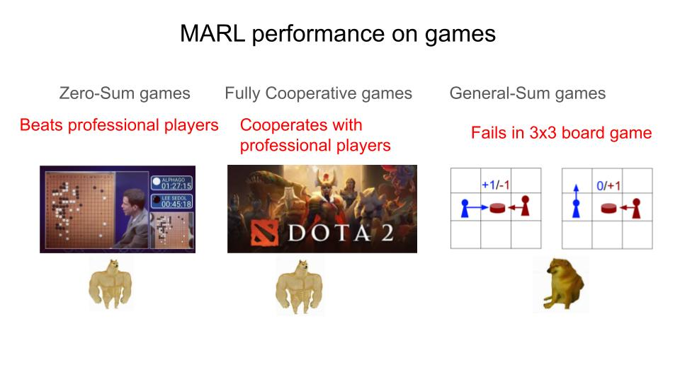

# LOQA: Learning With Opponent Q-Learning Awareness
This is the repository that contains the codebase of LOQA (Learning with Opponent Q-Learning Awareness) paper.
It may be surprising a little, but Naïve RL fails badly on general sum games. One subset that shows this clearly are social dilemmas like IPD and Coin Game. Most of the games in the real world are actually general sum and many of the most important ones, countries negotiating, bussiness deals, scientists deciding what to disclose and what not to, etc is general sum and also a social dilemma. Methods like LOLA and POLA shed light on the reason behind this failure but their methods require constructing explicit huge optimization graphs of the opponent's optimization and differentiating through it and therefore not scalable. 
LOQA sidesteps modeling explicitly the opponent's optimization by realising that the op's optimization is following the opponent's return. Therefore, by shaping the return (Q-values) we shape the opponent.

LOQA is the most scalable Opponent Shaping Algorithm yet improving the speed of finding reciprocation-based cooperative policies by two orders of magnitude compared to previous SOTA which is POLA. Also, on larger games where POLA fails, LOQA succeeds. In a world where agents will be used to help us in decision making, making sure their optimization can actually solve the real world's general sum games is very important. Therefore:

## Installing the environment

LOQA's code has been written with `jax` and `flax` as the neural network library.
If you just want to run the code on cpu, for debugging or playing around purposes, then you most probably will only
need to run `pip install -r requirements.txt` and then follow the provided examples. 

If you want to run the code on gpu, then you will need to install the
appropriate version of jax and flax for your specific gpu. Usually, it is a bit of pain. Especially, if you're on a computing cluster where you don't have sudo access. Refer to installation instructions from the [jax](
https://github.com/google/jax) and [flax](https://github.com/google/flax) repositories. I hope google team makes the installation of jax as easy as pytorch one day. 

Also, while the code most probably will be fine with newer versions of `jax` and `flax` there is a slight chance it breaks because these two are not backward compatible. In that case, just install the older one, or you may need to do some code changes (which understandably is not on anyone's wishlist. But, it happens sometimes. During the development of this own project, the flax UI for GRUs changed. First, I thought I somehow have corrupted the code and took me a long time to understand it was just a simple change).

# Understanding the LOQA's Implementation
If you want to implement LOQA as a basline or if you want to improve upon LOQA, we recommend studying the `ipd.py` first. This a self-containing script that runs LOQA on IPD. After that understanding `coin_train.py` should be easier. Also, you can jump straight into the coin script. The main LOQA magic is happening in the `agent_policy_loss` method. LOQA can have different implementations, based on how you make the rewards differentiable. `n-step` just makes the next n rewards differentiable. However, `loaded-dice` is the main condition used in LOQA results that makes the whole return differentiable but it is harder to understan. In order to understand what is happening with the DICE, you can study the DICE and Loaded-DICE paper. However, just keep in mind at the end DICE is an engineering trick. All of these terms coudl have been written as expectations like how we write REINFORCE. But DICE makes this much easier. Just note that the `magic_box` gives you 1 in the forward pass, but in the backward pass it switches to log probability. That is the key to understanding DICE. If you have any questions, just message me on my email: mi[dot]aghajohari[at]gmail[dot]com


# Recreating the LOQA Paper Results
## Current 3x3 Coin Game LOQA Self-Play

This repository is configured to run LOQA self-play on the modified 3x3 Coin Game:

- each episode has 200 environment steps;
- each CSV/W&B row averages 20 episodes, i.e. 4000 environment timesteps;
- total training lasts 3e7 environment timesteps;
- metrics are written to `experiments/<run_id>/train_iteration_metrics.csv`;
- when W&B is enabled, `<run_id>` is the W&B run id.

On the cluster `socialjax` environment, run:
```python
python coin_train.py hp=loqa_iclr wandb.state=enabled "wandb.tags=[coin,loqa_3x3]"
```

If you need to invoke the conda environment explicitly:
```
conda run -p /data/home/fzy/miniconda3/envs/socialjax python coin_train.py hp=loqa_iclr wandb.state=enabled "wandb.tags=[coin,loqa_3x3]"
```

For a short smoke test without W&B:
```
conda run -p /data/home/fzy/miniconda3/envs/socialjax python coin_train.py hp=loqa_iclr wandb.state=disabled hp.max_train_timestep=4000 hp.save_every=999999 hp.eval_every=999999
```

On a local machine where `socialjax` is located at `/opt/anaconda3/envs/socialjax`, use:
```
conda run -p /opt/anaconda3/envs/socialjax python coin_train.py hp=loqa_iclr wandb.state=enabled "wandb.tags=[coin,loqa_3x3]"
```
